#                                                              信号

## 信号描述

## 信号相关的概念

## 信号4要素

## 信号的产生

           - ​      kill 命令

## kill函数、命令产出信号

## alarm函数产生信号

- ==一个进程只有唯一的一个闹钟==

- 用alarm统计计算机一秒能数多少数

- 使用time命令查看程序执行消耗的时间
- 实际时间=用户时间+内核时间+等待时间
- time./alarm>out  ------程序优化的瓶颈在IO

## setitimer 函数（定期器）*

例如：

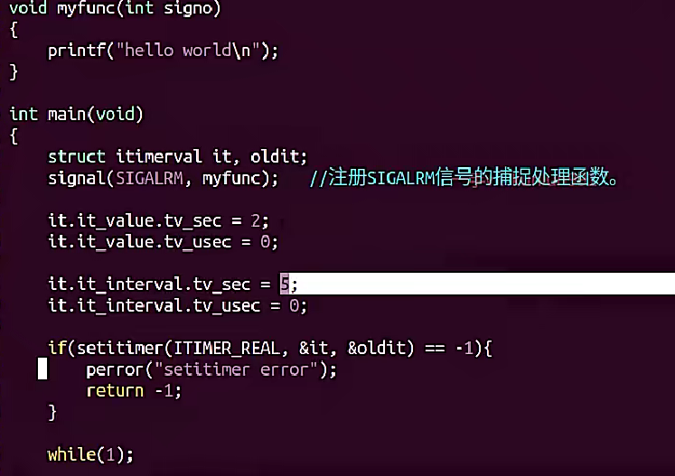

## ==信号集操作函数==

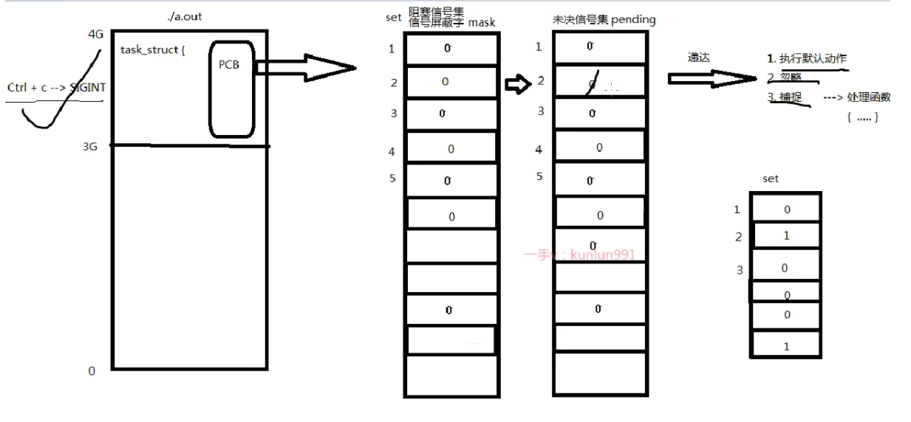

信号操作集函数

**操作自定义信号集函数**

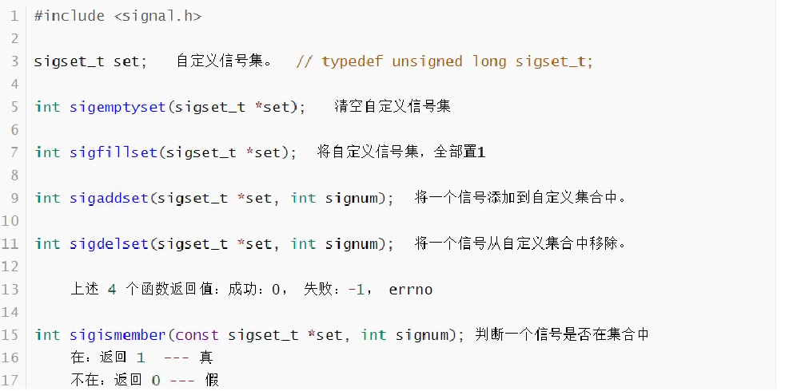

## 操作信号屏蔽字mask的信号集操作

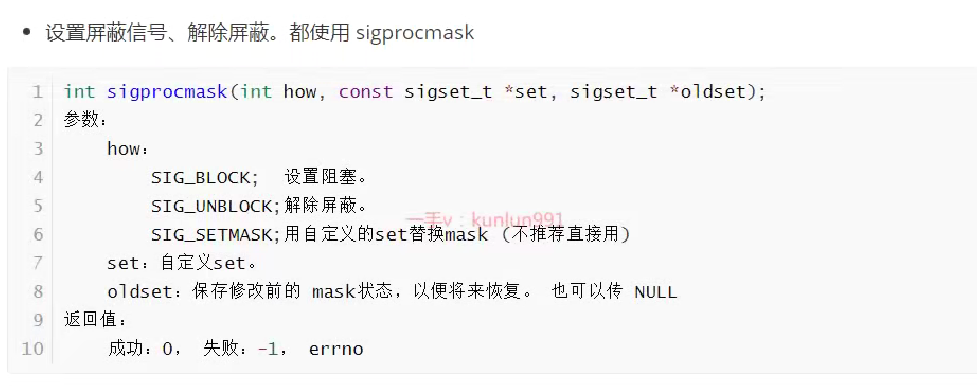

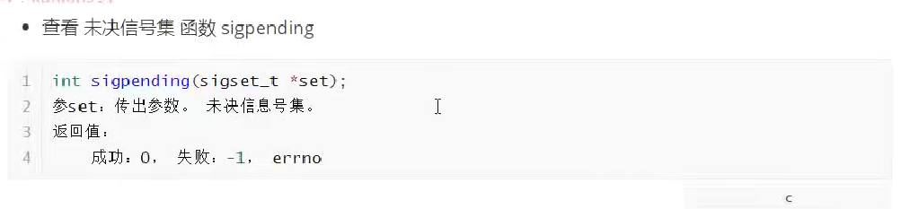

- 实例查看未决信号集：

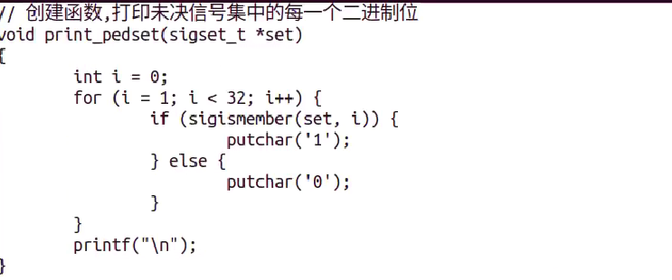

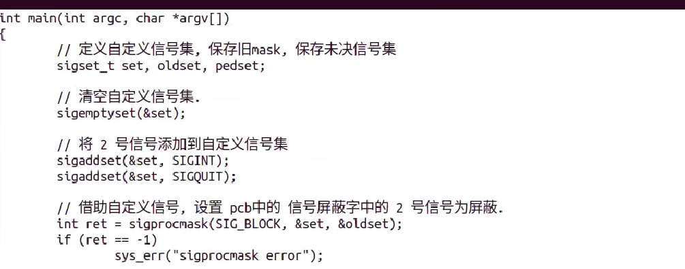

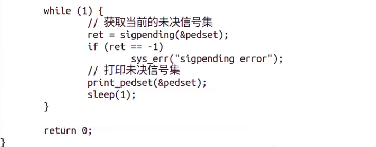

==**9和19号信号不能屏蔽，忽略，捕捉**==

## 信号捕捉

**signal函数***：

示例：

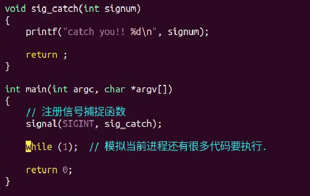

==**sigaction函数**==

- 注册某一个信号的捕捉事件，指定回调函数

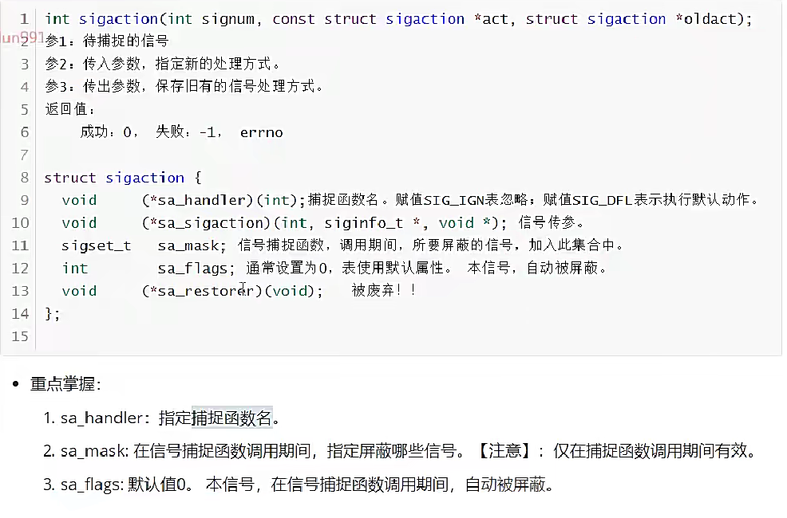

==**sigaction函数实现信号捕捉：**==

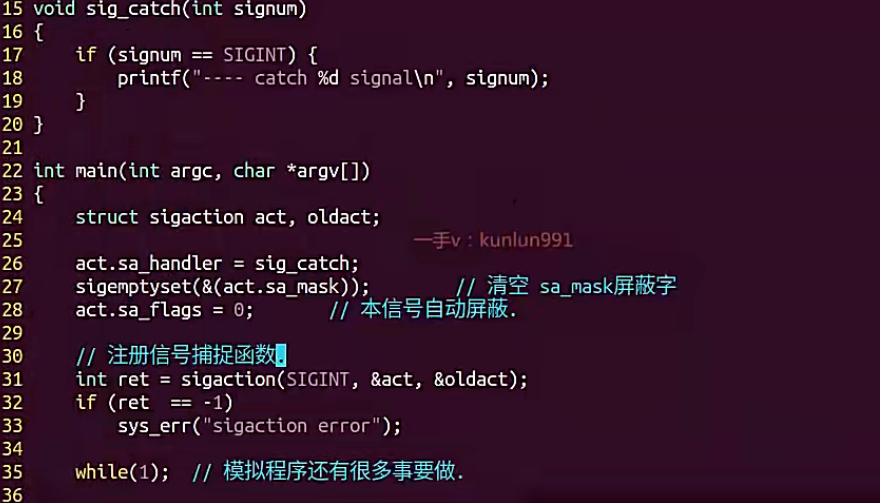

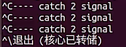

**信号捕捉特性：**

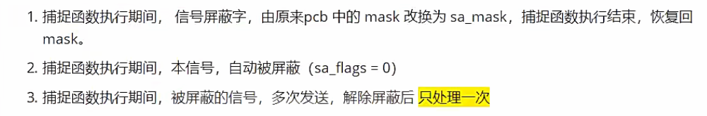

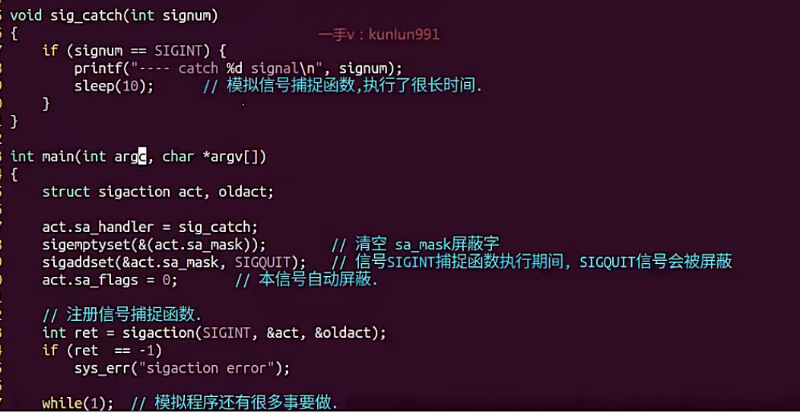

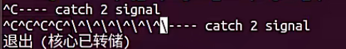

## 借助信号捕捉，完成子进程回收

**SIGCHLD信号产生条件：**

==**回收子进程代码：**==

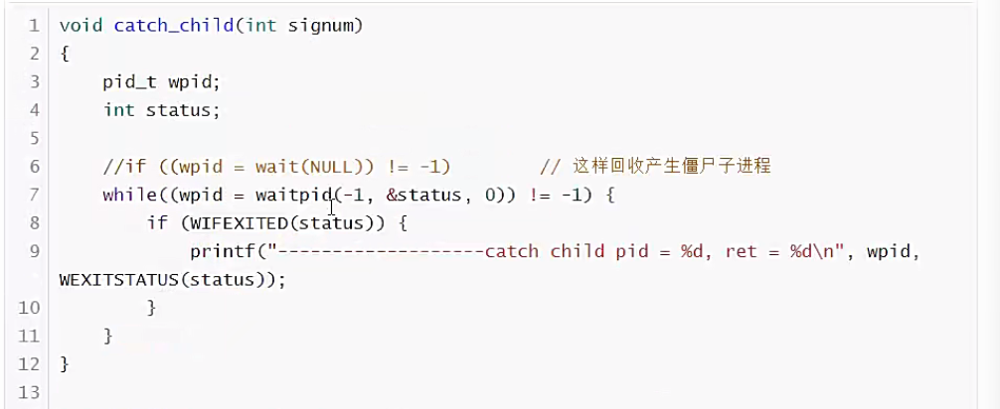

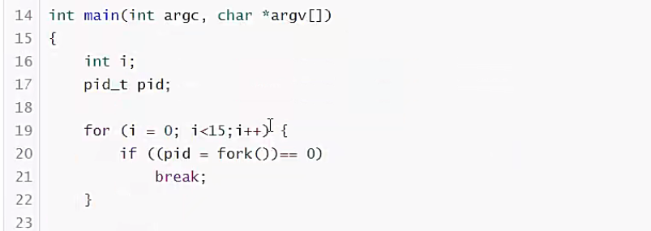

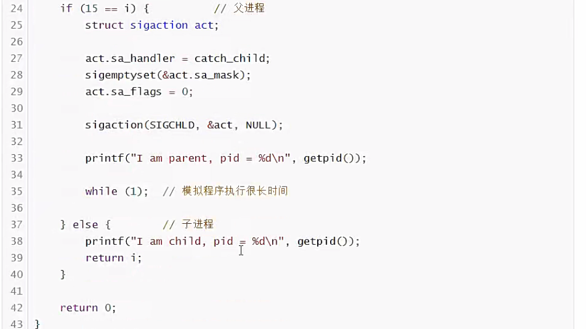

## 内核实现信号捕捉过程

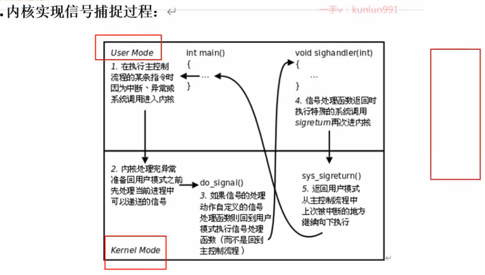
