# 进程和线程

## 进程组和会话

- 进程聚集称为进程组，多个进程组聚集称为会话

- ps ajx 查看进程组id和会话id

- 创建会话

- getsid函数

- ==setsid==

## 守护进程

### 守护进程概念

### 创建守护进程

- 代码：

# 线程

## 线程的概念

## 线程内核实现原理

* 三级映射

## 线程共享

## 线程优缺点

## 线程控制原语

### 获取线程ID

### 创建线程

## 创建子线程

## 循环创建子线程

## 线程退出

## pthread_join回收线程退出值

- 示例一：

- 示例二：

## pthread_detach线程分离

## 杀死（取消）线程

## 终止线程的方法

## 线程进程终止原语对比

# 线程同步

- 同步：即协同步调，按预定的先后次序访问共享数据。
- 线程同步，指一个线程发出某一个功能调用时，没有得到结果之前，该调用不返回。同时，其他线程为保证数据一致性，不调用改功能。

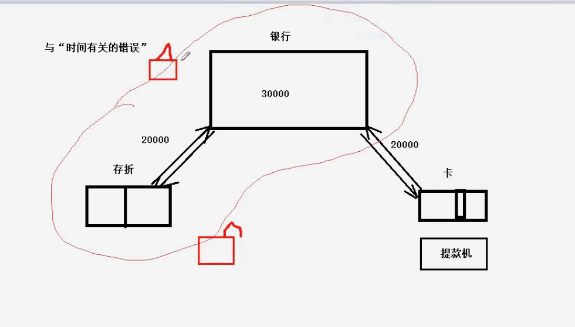

-  数据混乱产生的原因：

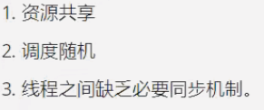

- 只能从第三步着手解决“数据混乱”，避免产生与时间有关的错误。执行多个控制流（线程）访问共享的数据的先后顺序

- 锁的属性：

## 互斥量（互斥锁）

- 函数：

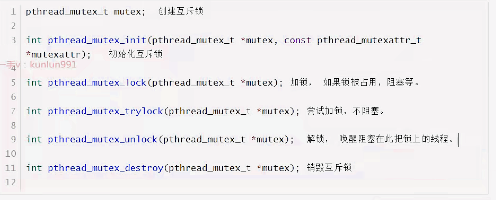

示例：

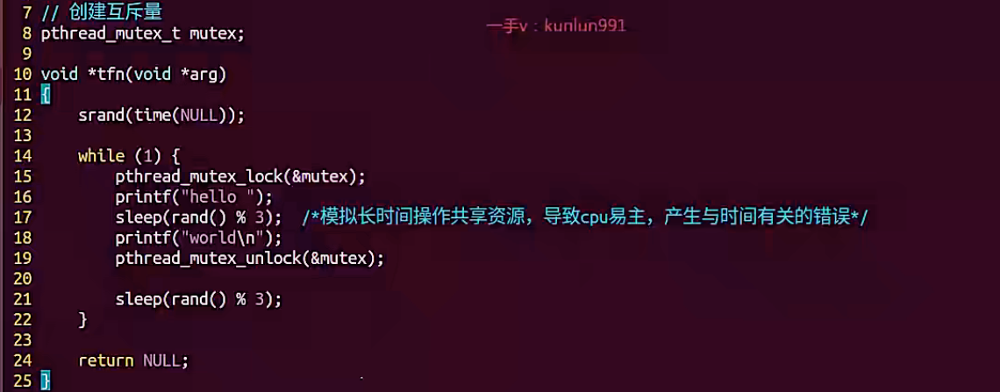

- 注意事项

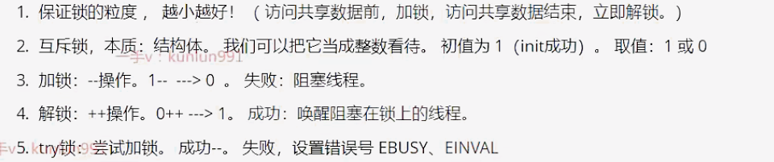

- 互斥量初始化方法：

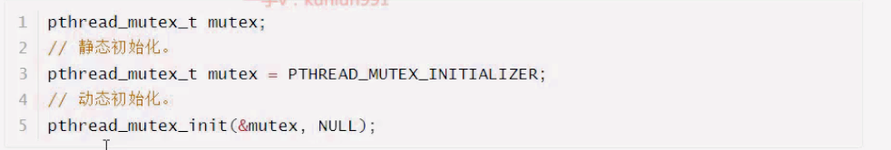

## 死锁

- 不是一种锁！ 是错误使用锁的一种状态。

- 常见死锁种类：

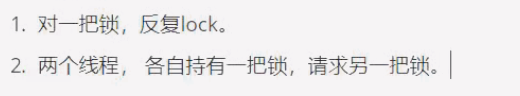

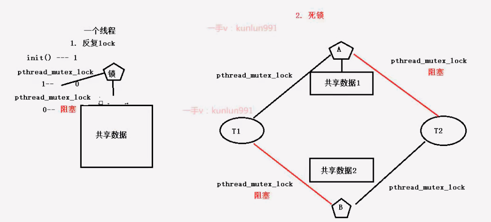

## 读写锁

==3句话描述==

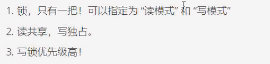

若读锁已经加锁成功，写锁无法加锁

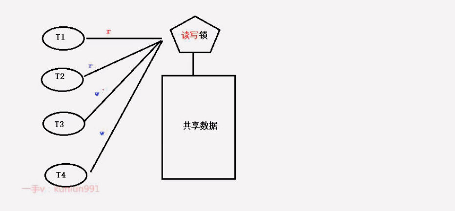

- 相较于互斥锁，读写锁非常适合于对数据结构的操作次数，远大于写的操作次数的场景

==函数：==

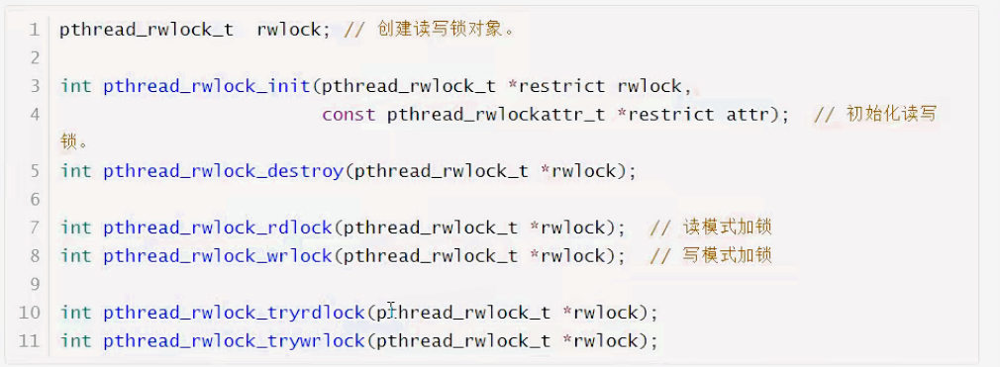

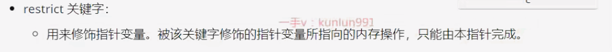

==读写锁使用示例：==

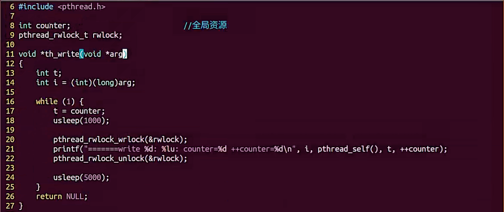

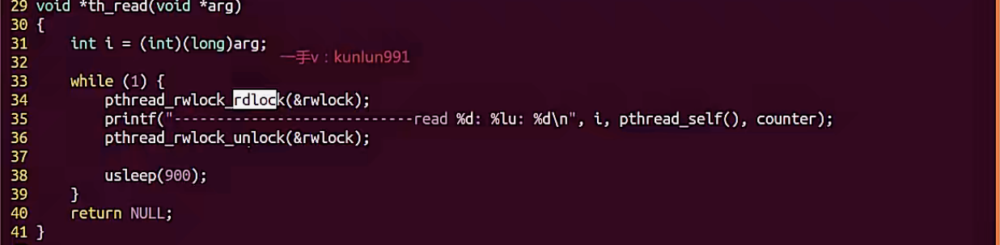

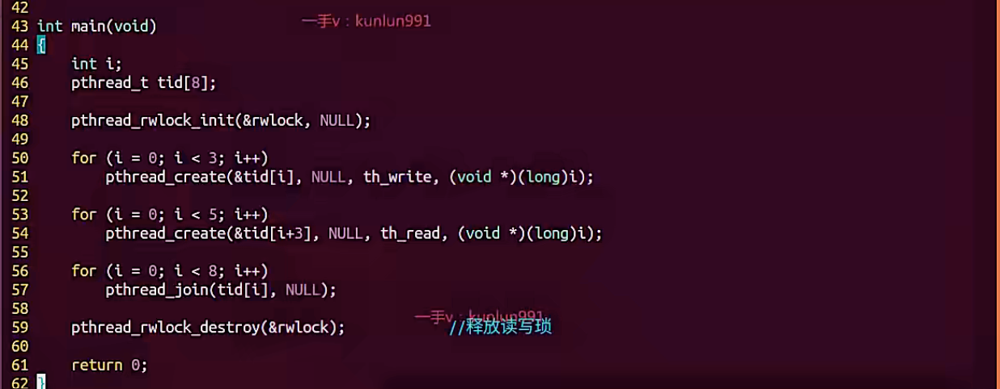

## 条件变量

==函数：==

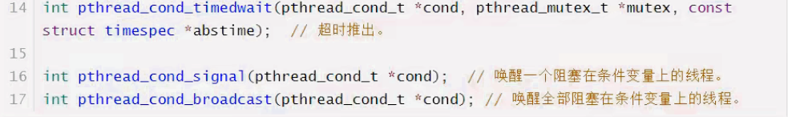

## 生产消费者模型

 

代码：

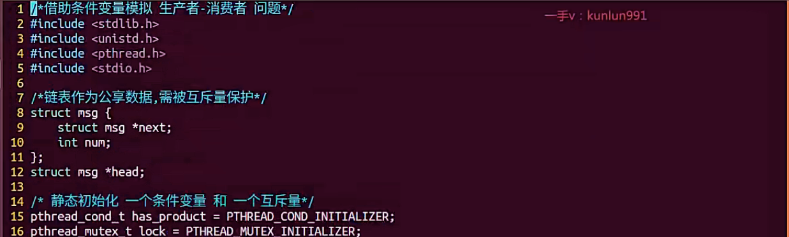

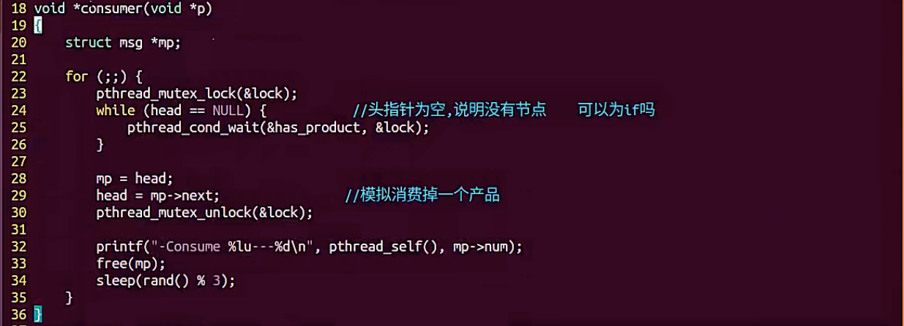

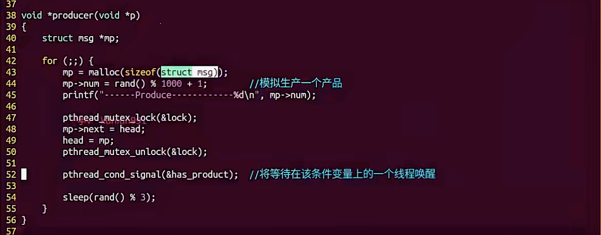

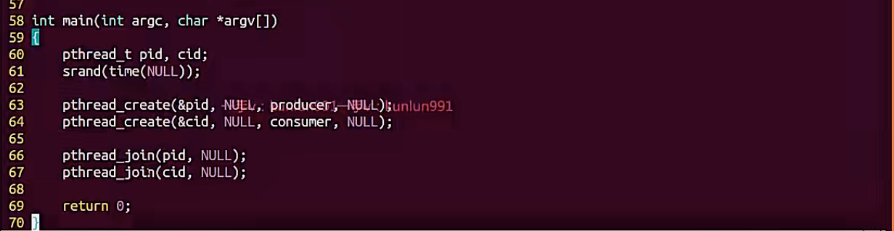

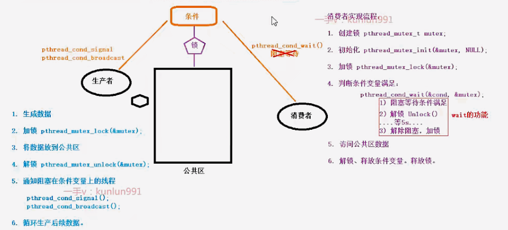

- 多生产者消费者

## 信号量（semaphore）

==函数：==

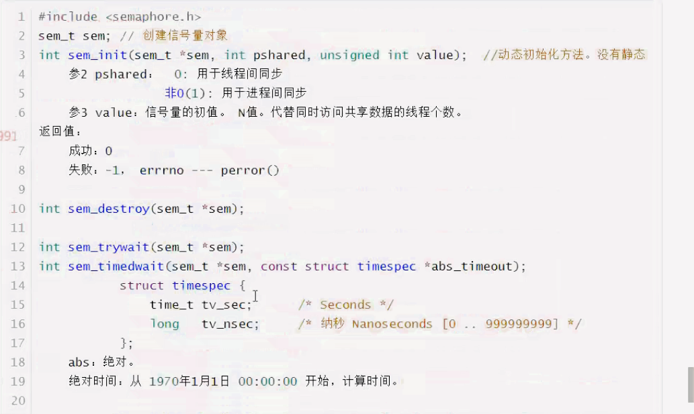

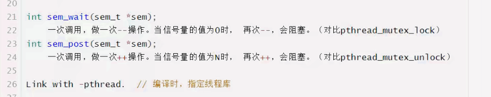
