# 进程和线程

## 进程组和会话

- 进程聚集称为进程组，多个进程组聚集称为会话

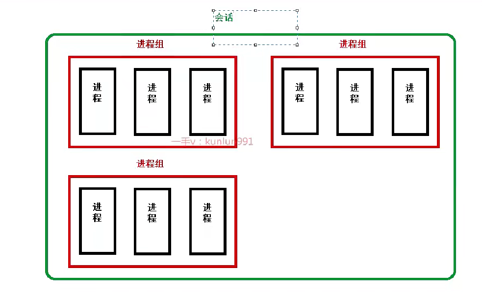

- ps ajx 查看进程组id和会话id

- 创建会话

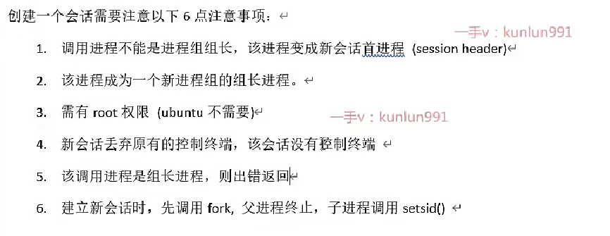

- getsid函数

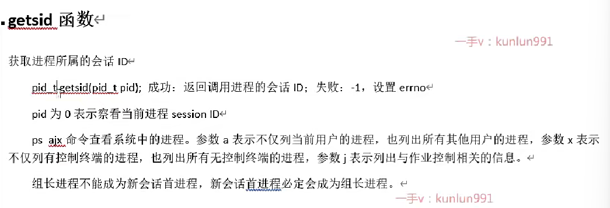

- ==setsid==

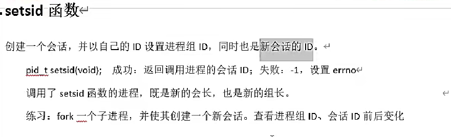

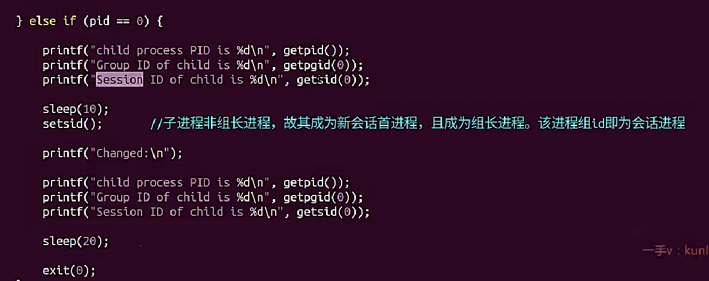

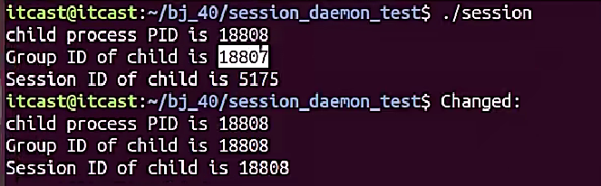

## 守护进程

### 守护进程概念

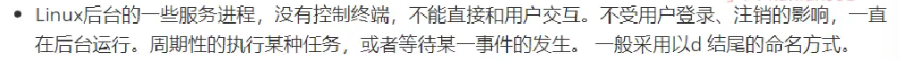

### 创建守护进程

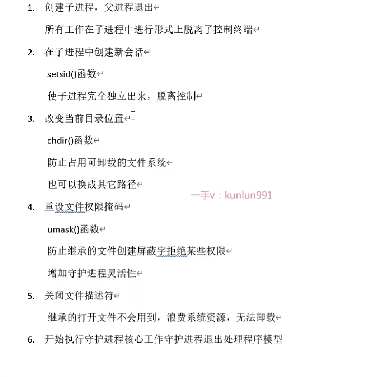

- 代码：

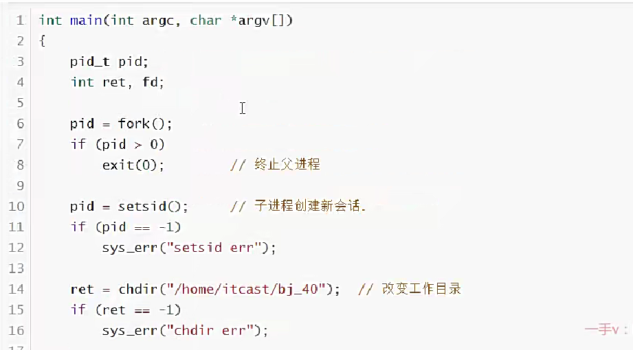

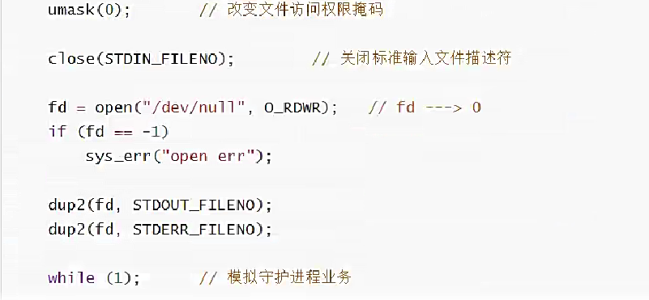

# 线程

## 线程的概念

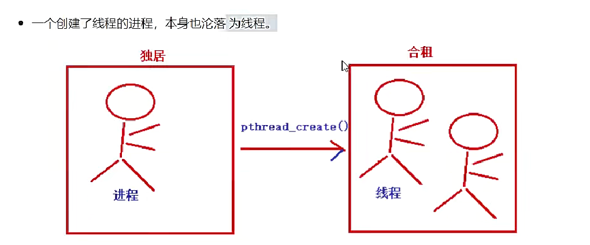

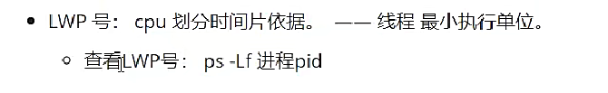

## 线程内核实现原理

* 三级映射

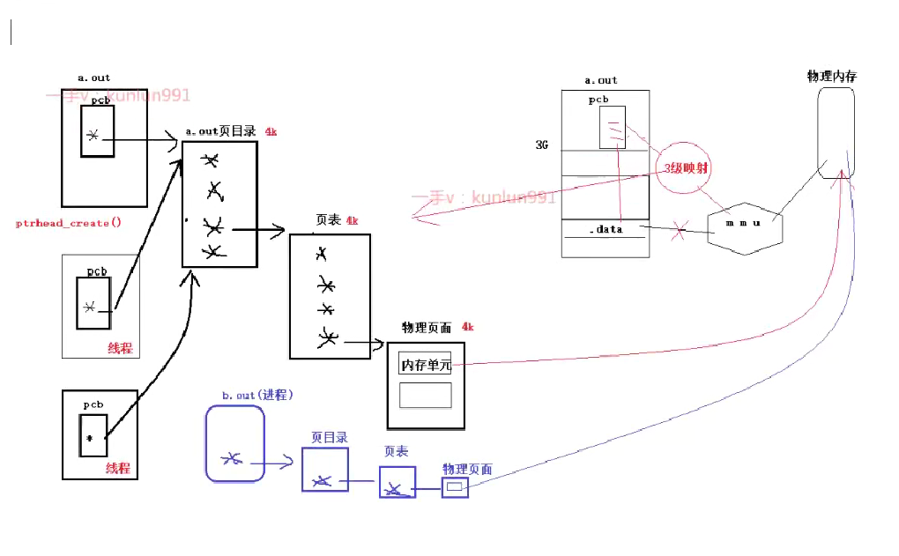

## 线程共享

## 线程优缺点

## 线程控制原语

### 获取线程ID

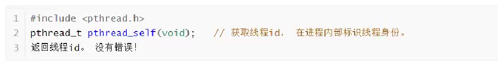

### 创建线程

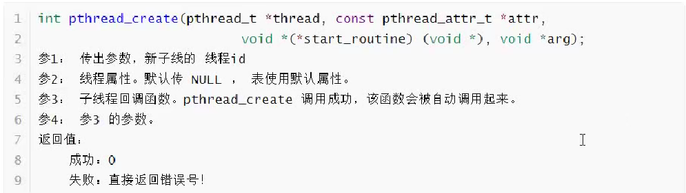

## 创建子线程

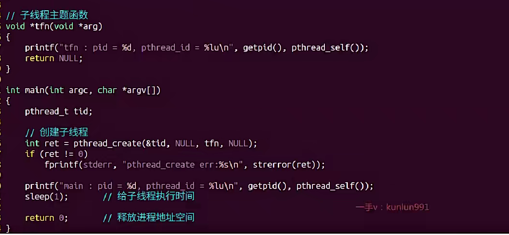

## 循环创建子线程

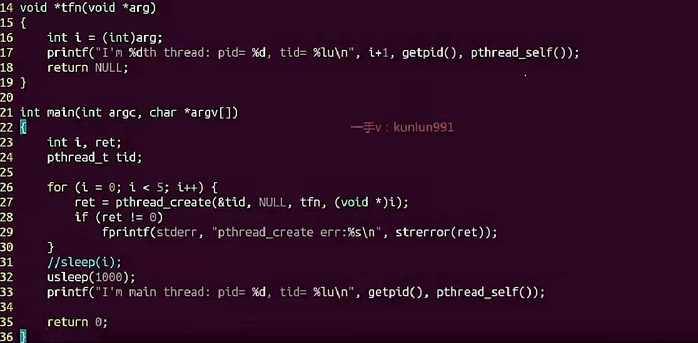

## 线程退出

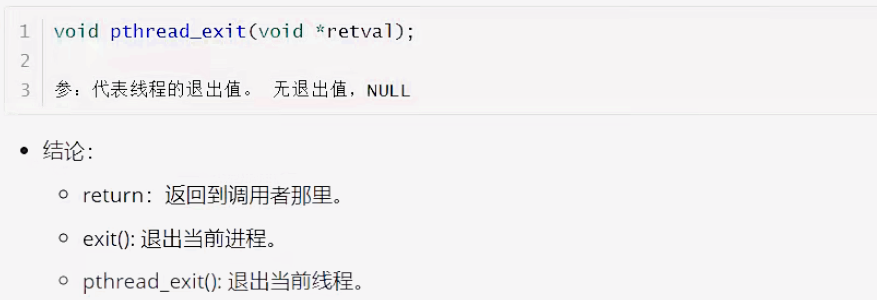

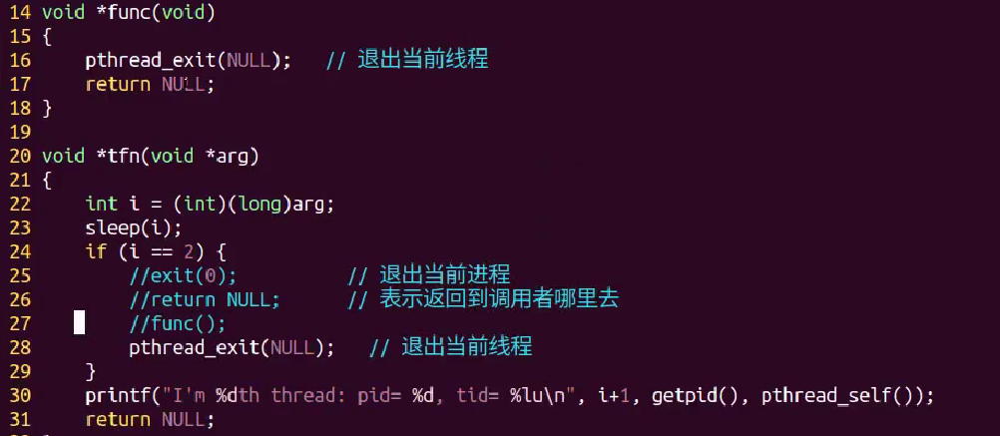

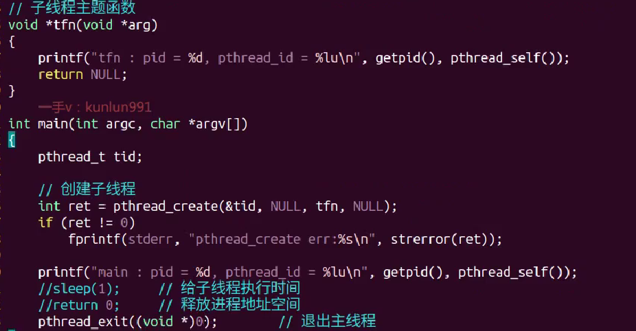

## pthread_join回收线程退出值

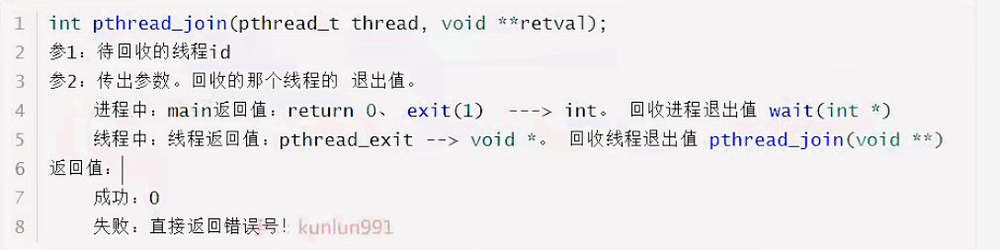

- 示例一：

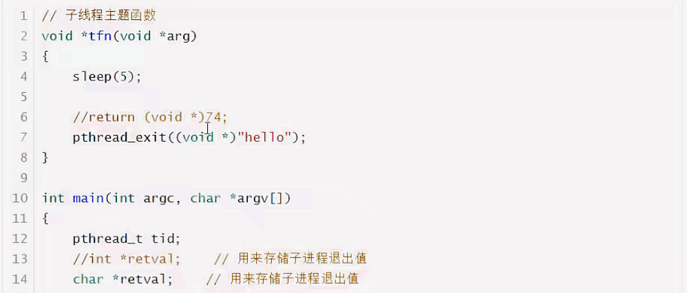

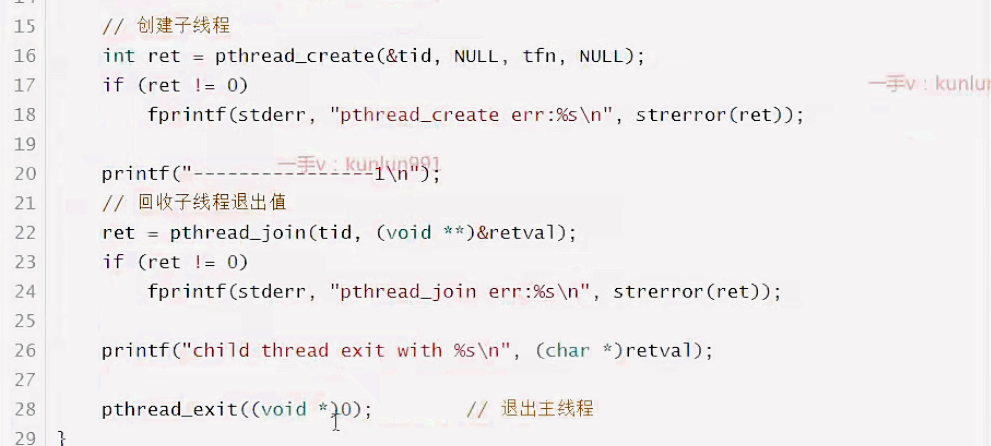

- 示例二：

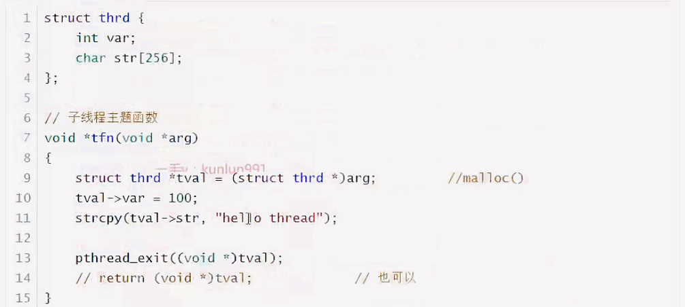

## pthread_detach线程分离

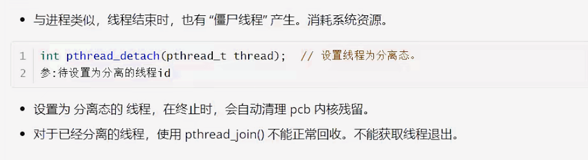

## 杀死（取消）线程

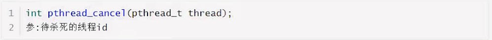

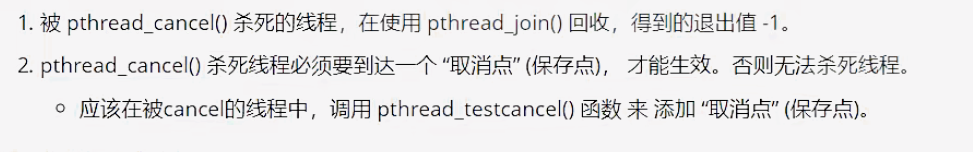

## 终止线程的方法

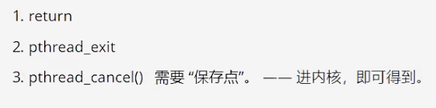

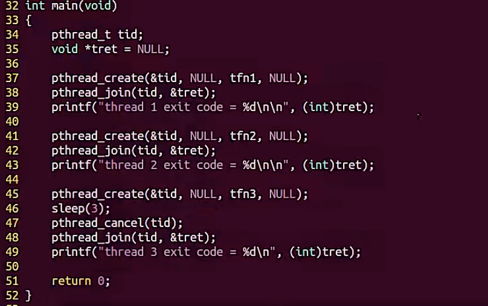

## 线程进程终止原语对比

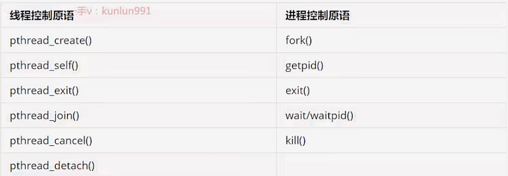

