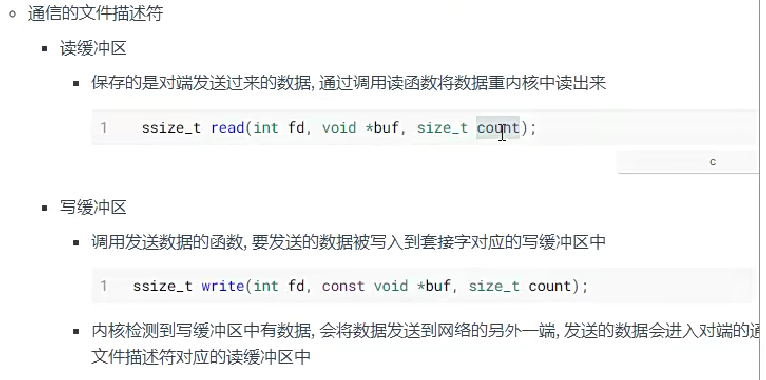
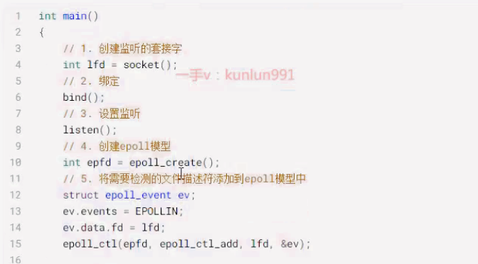
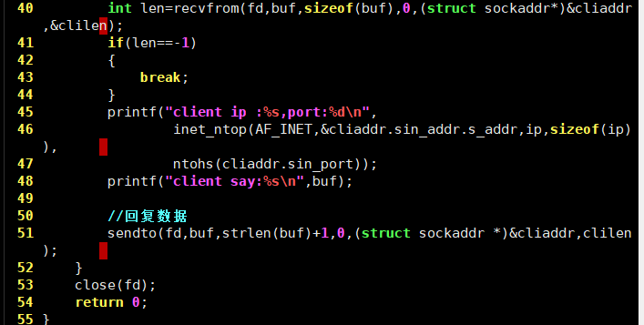

<center> linux网络编程</center>

# 套接字通信基础

## 概念

- 网络设计模式
  - B/S
    - broswer-浏览器->客户端
      - html
      - css
      - js
    - server->服务器
    - 优势：
      1. 跨平台
      2. 开发成本低
    - 缺点：
      1. 网络通信时，必须要使用http协议
         - HTTP/HTTPS（加密）->应用层协议
      2. 不能在磁盘缓存或者从磁盘加载大量数据
  - C/S
    - client->桌面应用程序 （QQ，微信，迅雷）->QT
    - server->服务器
    - 特点：
      1. 优点：
         - 使用的协议可以随意选择
         - 可以在本地缓存或者加载大量数据
      2. 缺点：
         - 研发成本高-不同平台不同的客户端版本

- 服务器：

  - 硬件：配置比较高的主机
    - 买阿里云，百度云服务器
  - 软件：有一台主机，主机上运行了一个进程，该进程可以处理网络协议，称这台主机是一个服务器
    - nginx
  - 服务器开发：
    - 工作不是去开发web服务器
    - 我们做的工作：
      - 在一台装有服务器的主机上开发应用程序
        - 斗地主
        - 文件服务器

- IP和端口

  - IP地址分类

    - 公网IP
      - 可以访问Interface，公网IP是唯一的
    - 局域网IP
      - 小的网络，比如路由器对应家里的网段
        - 192.168.6.xxxx
      - 在这个最小的网络中IP是唯一的
      - 在这个网络中的主机可以相互通信
      - 如果局域网和外网连接，那么通过局域网也可以连接外网

  - IP协议

    - IPV4-"Internet Protocol Version 4"

      - 现在应用很广泛
      - IP地址的点分十进制字符串
        - 192.168.1.100
      - 本质是整型数，4字节，32位
        - 通过3个点分成4分，每份一个字节
          - 字节取值范围 0-255
          - 最大IP地址：255.255.255.255
      - 可用IP地址：
        - 2的32次方-1
      - IPv4非常不够用

    - IPV6-"Internet Protocol Version 6"

      - 将来主推的一种协议

      - 本质也是整型数 16字节 128 位（bit）

      - IP地址表示：

        - 分为8分，每份2字节，使用16进制数字表示

        - ```shell
          fe80::20d4:1a84:6918:546a
          ```

        - ```shell
          fe80:0000:0000:0000:20d4:1a84:6918:546a
          ```

      - Linux相关的命令

      - ```shell
        #linux
        $ ifconfig
        # windows
        $ ipconfig
      
      - 
      
      - 只要是192.168.x.x格式都是局域网IP
      
      - 公网IP：11.13.35.67
      
      - 测试：ping 域名  / ping IP地址
      
      - IP地址个数：
      
        - 2的128次方-1
  
- 端口

  ```shell
  #1.端口本质
  无符号短整型数->unsigned short
  # 2.端口的取值范围
  1.可以有多少端口：2的16次方 
  2.取值范围：0-65535
  # 3.端口的作用
  定位某台主机上运行的进程
  # 4. 如何给自己编写的应用程序分配端口
  -0 端口一般不用
  - 1-1024：系统使用
  - 1014-5000：系统预装的程序/一些常用的协议使用
  - 5001-65525：留给用于自定义的端口
  # 5.所有的程序都要有端口吗？
  如果进程不通信则不需要
  如果通信就需要给程序进程绑定端口
       -bind()
  ```

- IP和端口的使用

- ```shell
  # 通过IP定位网络环境中的主机，通过端口定位主机上的进程
  # 比如通过浏览器进行网络服务器访问
  # 服务器有IP地址/域名，服务器需要绑定端口
  # b/s ->协议http ->使用的端口是80,https协议端口->443
  # 如果服务器使用的就是协议的默认端口，访问时候端口可以省略不写
  http://www.baidu.com:80
  https://www.baidu.com:443
  
  http://192.168.1.100:9999
  
  # 域名：特殊的字符串，通过字符串可以访问到web服务器了
  # 为什么？
      - 域名需要先申请。然后需要和web服务器的外网IP绑定
      - 绑定成功之后，才能通过域名访问到web服务器
      - IP为什么要和域名关联？->方便记忆网站地址
      - 通过域名取访问web服务器->连接dns服务器->查询域名和IP的对应关系->得到了域名对应的IP地址->通过IP地址访问web服务器
      IP地址->通过IP地址访问web服务器


- OSI/ISO 网络分层模型


- 网络协议是什么


- 数据在网络环境中的发送和接受过程


==程序员只需要处理应用层，应用层以下不需要我们处理==


- **==套接字通信==**


```c
# 套接字通信就是网络通信，跟语言无关，因为通信是基于协议的，所有的编程都需要基于协议对数据进行处理
// 1.套接字是什么
1.套接字就是一套网络通信接口，这个接口封装了传输层协议（tcp/udp)
2.接口就是api,就是一套函数

//2.socket（插座），套接字通信组成部分？
1.服务器端，插座的作用
        -被动接受的角色，不会主动发起连接的
        -绑定固定IP和端口，这样客户端才能连接

2.客户端
         -主动连接服务器
         -连接服务器需要地址：
               -IP+端口
               
//3.怎么用？  ->所有编程语言的通信流程都是固定的
    -服务器有通信流程
    -客户端有通信流程
    
// 4.套接字通信过程中数据要使用网络字节序
字节序：字符在内存中的存储顺序，单位是字节，char类型不需要研究字节序问题
    字符串没有字节序问题
字节序的分类：
      - 网络字节序
      - 主机字节序
    
   char -> 1字节
   int ->  4字节
 
```


- 字节序


 - 概念：
   - little-endian
     - 小端，也称之为主机字节序
     - 在内存的低地址位，存储数据的低位字节，在内存的高地址位存储数据的高位字节
       - 低低高高
     - pc机都是小端存储，跟CPU架构有关
   - big-endian
     - 大端，也称之为网络字节序
     - 在内存的低地址位，存储数据的高位字节，在内存的高地址位存储数据的低位字节
     - 网络通信时，要使用大端字节序

- 大小端存储举例


## IP和端口大小端转换函数

- 函数


- 字符串类型IP地址转换

1. int inet_pton()  主机字节序的字符串类型IP->大端的整型数


2. const char * inet_ntop()   大端的整型数->主机字节序的字符串类型IP


# TCP通信

## TCP特点


## 套接字通信里面的文件描述符结构


## 套接字通信服务端的通信流程

```c
/*
	在服务器端有两类文件描述符：
		1.监听的
		- 检测有没有新的客户端连接服务器
		-服务器端一个就够了
		2.通信的
		-负责和建立连接的客户端通信
		-和多少个客户端建立了连接，就有多少个通信文件描述符
*/

//1.创建一个用于监听的套接字，这个套接字就是一个文件描述符
//   类似管道中的文件描述符，对应是内核中的内存。通过文件描述符操作就可以写读内核中的内存数据
int lfd=socket();

//2.让监听的文件描述符和本地IP+端口进行绑定，为了让客户端找到服务器
//     绑定成功之后，lfd就可以检测到有没有客户端连接请求了
bind();

//3.g给绑定成功的套接字设置监听
listen();

//4.等待并接受客户端连接，得到一个新的用于通信的文件描述符
int cfd=accept();

//5.使用accept返回值对应的通信文件描述符和客户端通信
//接受数据
read();
recv();

//发送数据
write();
send();

//6.断开连接，关闭文件描述符
//关闭通信的文件描述符，也能关闭监听的文件描述符
close();

```


## 基于TCP的客户端的通信流程

```c
//在TCP的客户端文件描述符只有一种：通信的文件描述符

//1.创建用于通信的套接字==（文件描述符）
int fd=socket();

//2.使用创建的通信文件描述符连接服务器，通过服务器绑定的IP和端口进行连接
connect();

//3.连接成功之后，通信
//接受数据
read();
recv();

//发送数据
write();
send();

//4.断开和服务器连接
close();

```


## 文件描述符对应的内核缓冲区和读写操作之间的关系





## 创建套接字函数

```
// 创建一个套接字（文件描述符），用于通信和监听都可以
int socket(int domain,int type,int protocol);
参数：
-domain：
 -AF_INET:使用ipv4网络协议
 -AF_INET6:使用ipv6网络协议
 
-type:
 -SOCK_STREAM:使用流式传输协议
 -SOCK_DGRAM:使用报式传输协议
 
-protacol:默认写0
  -流式协议，默认使用TCP
  -报式协议，默认使用udp
  
返回值：
成功：返回一个文件描述符
失败：-1
```


## 绑定函数


## 设置监听


## 等待并接受客户端连接请求-accept（）函数


## 接收数据-read(),recv()函数


## 发送数据和连接函数


## IP和端口需要使用的网络字节序

 绑定时IP和端口都需要使用大端转换

连接时也是大端（网络字节序）


## 基于tcp的服务器端程序


## 基于tcp的客户端实现


# 三次握手四次挥手

## 知识点概述


## tcp协议


## 三次握手过程


## 四次挥手过程


## TCP滑动窗口


## 滑动窗口如何控制发送端阻塞


## TCP通信关键字


## tcp通信的全部过程分析


# 套接字并发服务器


## 上面套接字服务器的弊端

**无法处理多个客户端**


## 如何通过多进程的方式完成服务器端的并发


- 多进程版的服务器开发


## 多进程服务器


## 多线程版tcp服务器思路处理


# TCP状态转换


## 三次握手状态变化

```c
//tcp通信状态的变化
///////////三次握手////////////
//先启动服务器->绑定->设置监听 listen()
  服务器的状态变化： 无状态->LISTEN
//状态变化是从三次握手开始的（客户端发起连接）
第一次握手：
      客户端：给服务端发送SYN，无状态->SYN_SENT
      服务器：接受数据：LISTEN
      
第二次握手：
      服务器：给客户端回复ACK，并发送连接请求SYN，状态：LISTEN->SYN_RVCD
      客户端:受到ACK，状态：SYN_SENT->ESTABLISED
 
第三次握手：
       客户端：回复ACK，状态没有变化
       服务器：收到ACK，状态：SYN_RVED-ESTABLISED
      
```

- 在双向连接建立之后，通信过程，tcp状态不会发生变化


## 四次挥手状态变化

```c
///////四次挥手////////
第一次挥手:
	客户端：
	1.调用了close（）函数，相当于在tcp协议中将FIN设为1
	2.状态变化：ESTABLISED->FIN_WAIT_1;
	服务器：
	状态无变化：ESTABLISED
	
第二次挥手：
	服务器：收到FIN，回复ACK，状态：ESTABLISED->CLOSE_WAIT
	客户端：收到ACK，状态变化：FIN_WAIT_1->FIN_WAIT_2
	
第三次挥手：
	服务器：给客户端发生断开连接请求，FIN设为1，状态变化：CLOSE_WAIT->LAST_ACK
	客户端：收到服务器断开连接的请求FIN,状态变化：FIN_WAIT_2->TIME_WAIT
	
第四次挥手：
	客户端：回复ACK，状态没变
        -TIME_WAIT会持续一段时间，时间到达之后，周期结束
	服务器：收到ACK，LAST_ACK->无状态
	
	
```


## 处于TIME_WAIT的进程等待2MSL的原因


## 半关闭


## 半关闭函数


## 通过netstat命令查看进程的网络通信


## 端口复用


# IO多路转接之select


## IO多路转接


## select


==**函数细节**==


- 文件描述符集合操作函数

```c
 //fd_set类型数据操作函数
//将文件描述符fd从set集合中删除
void FD_CLR(int fd, fd_set *set);

//判断文件描述符fd是不是在set集合中，如果在返回1，如果不在返回0
int  FD_ISSET(int fd, fd_set *set);

//将文件描述符fd添加到set集合中
void FD_SET(int fd, fd_set *set);

//清空set中设置的所有数值，用于初始化
void FD_ZERO(fd_set *set);

```


## select的fd_set和文件描述符表关系


## 使用select处理服务端通信


# IO多路转接之epoll


## poll


- 函数


- 部分代码


## epoll


**三者比较：**


## epoll的使用


- 函数

 


## epoll的检测函数-epoll_wait()


## 基于epoll的tcp服务器的伪代码




 


## epoll的水平模式


- LT模式：通知频率高


## epoll的边沿模式


- ET模式


- 如何设置边沿模式


# udp通信

## udp特点


## udp通信流程


- 服务器端


- 客户端


## sendto和recvfrom函数

- 发送数据函数


- 接收函数


==接收和发送数据的函数默认是阻塞的==


## udp服务器程序代码





## udp客户端代码


## udp应用场景


## 广播


- 特点


- 通信流程


- 设置广播属性


- 数据发送端代码


- 数据接收端代码


## 组播（多播）


- 组播地址


- 组播通信流程


- 设置组播属性


- 加入到组播地址


- 组播特点总结


